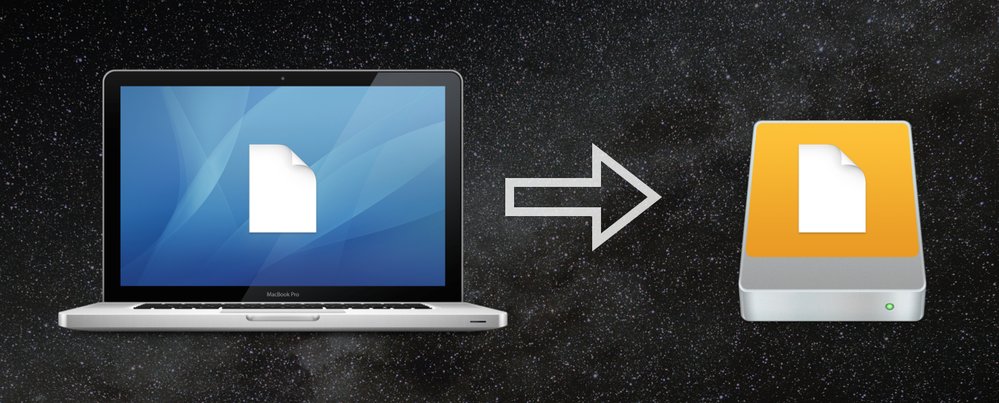
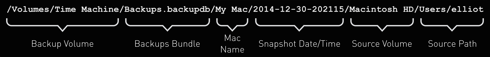
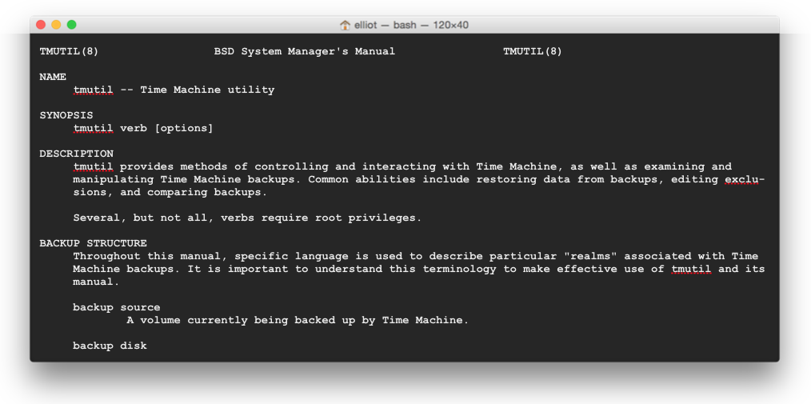
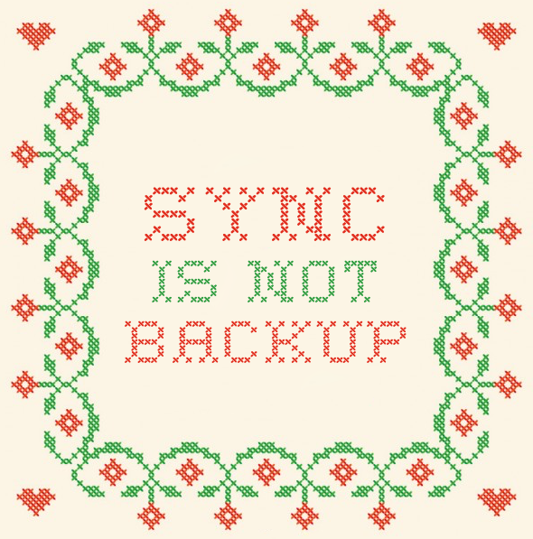
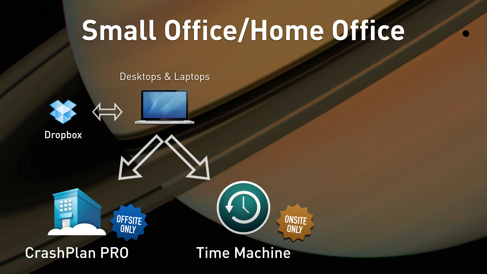
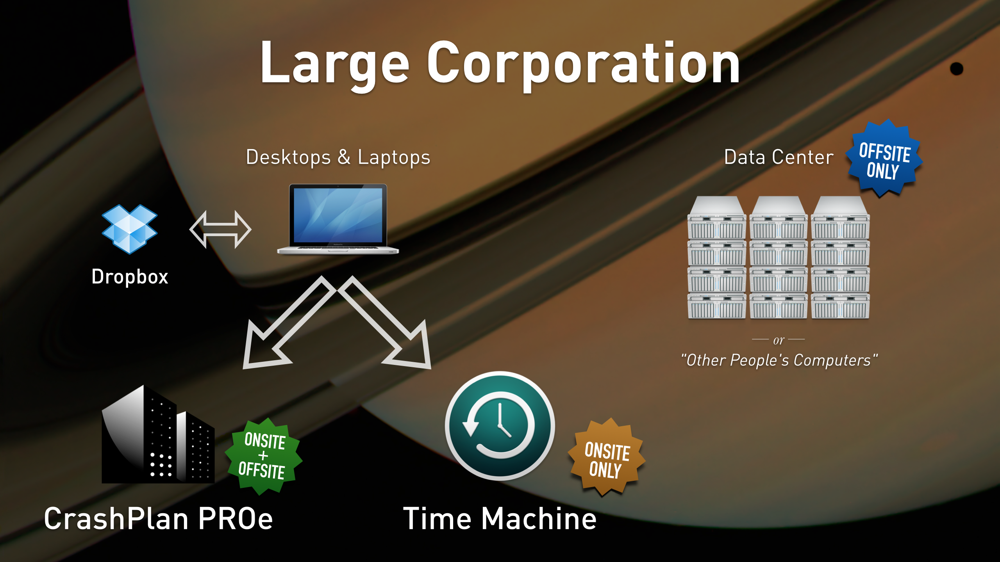
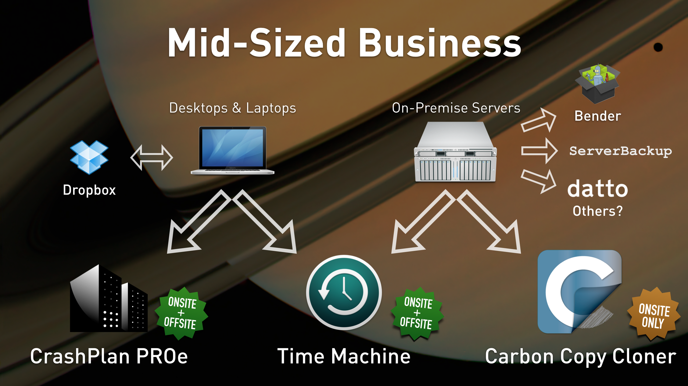

# Time Machine Deep Dive — and fitting it into a backup strategy

_Presented by Elliot Jordan, Senior Consultant, [Linde Group](http://www.lindegroup.com)_<br />_MacTech Pro — March 25, 2015 — San Francisco, CA_

---


## Table of Contents

- [What is Time Machine?](#what-is-time-machine)
- [Time Machine on OS X Server](#time-machine-on-os-x-server)
- [Time Machine Utility (tmutil)](#time-machine-utility-tmutil)
- [The Big Picture](#the-big-picture)
    - [Time Machine: Advantages and Limitations](#time-machine-advantages-and-limitations)
    - [Carbon Copy Cloner: Advantages and Limitations](#carbon-copy-cloner-advantages-and-limitations)
    - [CrashPlan: Advantages and Limitations](#crashplan-advantages-and-limitations)
- [Case Studies](#case-studies)
    - [Small Office/Home Office](#small-officehome-office)
    - [Large Corporation](#large-corporation)
    - [Mid-Sized Business](#mid-sized-business)
- [Resources](#resources)

---


## What is Time Machine?

Most of you are already familiar with the basics of Time Machine, so I'll briefly cover some basics before we dive into the juicy stuff.

The premise of any good backup system is that your important files are automatically copied to another place, where they will presumably be safe from harm. Time Machine implements this concept by copying your files to another hard drive, a Time Capsule, or a sharepoint on a file server. It performs these copies once every hour (by default).



"Hard links" are used to prevent unchanged files from being copied again; although it's important to know that this space saving occurs per-file, not per-byte. If any portion of a file has  changed, the entire file is backed up again.

Let's take a look at an example of a Time Machine destination file path.



- __Backup Volume__ (`/Volumes/Time Machine/`)
  The path to the external drive that you're backing up to.

- __Backups Bundle__ (`Backups.backupdb/`)
  This may be a .backupdb bundle or a .sparseimage, depending on whether you're backing up to a network volume or a locally-connected disk.

- __Mac Name__ (`My Mac/`)
  The name of your Mac, as shown in System Preferences > Sharing.

- __Snapshot Date/Time__ (`2014-12-30-202115/`)
  The date and time of the backup. There's also a "Latest" alias to the most recent snapshot.

- __Source Volume__ (`Macintosh HD/`)
  The name of the volume on the source that is being backed up. (You can back up multiple volumes from the same source.)

- __Source Path__ (`Users/elliot`)
  The path to the file being backed up. This may be a hard link, or it may be an actual copy of the file. For the purposes of restoring, it doesn't matter.


## Time Machine on OS X Server

OS X Server can act as a Time Machine destination for Macs on the network. Turning it on is super simple:

1. On the server, create a folder on a disk with plenty of available space. This folder will serve as the destination for networked Macs.
2. Open the Server.app and log into the server you wish to configure.
3. Click on the Time Machine service and slide the switch to ON.
4. Select the folder you created in step 1.
5. Set the size limit per backup, if desired.

Now, on the client Mac, the server should appear as an available destination in the Time Machine preferences. Set this up as you would with any normal Time Machine destination.

Backups can be monitored and sorted in the Backups tab of the Time Machine service.

Be sure to turn on email and push alerts in the Alerts settings section of Server.app.

Important note: OS X desktops and laptops can use Time Machine to back up to an OS X Server. But you still need to use the Time Machine preferences on the server to back up the server settings. Do not back up a server to itself! (More on backing up servers in the [Big Picture](#the-big-picture) section below.)


## Time Machine Utility (tmutil)

Here's the star of our show!

`tmutil` is a command-line interface for configuring and controlling Time Machine. It's very useful for broadcasting Time Machine commands to all your Macs.

`tmutil` has one of the best-written man pages:



Some examples of useful `tmutil` commands. Explore the man page to learn more about how these work and how you should customize them to your environment.

```
# Turn Time Machine off.
sudo tmutil disable

# Turn Time Machine on.
sudo tmutil enable

# Set a network drive as the Time Machine destination.
sudo tmutil setdestination -p afp://elliot@server01.pretendco.com/TimeMachineBackup

# Add (-a) another network drive as a second Time Machine destination.
sudo tmutil setdestination -p -a afp://elliot@server02.pretendco.com/TimeMachineBackup2

# Inherit an existing backup history.
sudo tmutil inheritbackup "/Volumes/Time Machine/Backups.backupdb/My Mac"

# Associate a volume with an existing machine backup.
sudo tmutil associatedisk -a "/Volumes/Macintosh HD" "/Volumes/Macintosh HD/Backups.backupdb/My Mac/Latest/Macintosh HD"

# Get information about the current Time Machine destination.
tmutil destinationinfo

# List all available backup snapshots.
tmutil listbackups

# List only the latest backup snapshot.
tmutil latestbackup

# Compare any two backup snapshots, or compare a specified snapshot to the latest one.
tmutil compare

# Calculate how much data was added, removed, or changed between backups.
tmutil calculatedrift "/Volumes/Time Machine/Backups.backupdb/My Mac"

# Calculate the unique size of a specific backup snapshot (e.g. the latest one)
tmutil uniquesize "$(tmutil latestbackup)"

# Disable local snapshot backups. (Useful on servers.)
sudo tmutil disablelocal

# Enable local snapshot backups. (Useful on laptops for road warriors.)
sudo tmutil enablelocal

# Exclude a folder from backup.
tmutil addexclusion /Users/elliot/Downloads

# Include a folder that was previously excluded.
tmutil removeexclusion /Users/elliot/Downloads

# Determine whether a specified folder is included in backup.
tmutil isexcluded /Users/elliot/Desktop

# Add a bunch of common exclusions.
tmutil addexclusion "/System" "/Library" "/Applications" "/var" "/etc" "/Developer" "/Groups" "/Incompatible Software" "/Volumes" "/bin" "/cores" "/usr" "/tmp" "/temp" "/opt" "/net" "/home" "/Shared Items" "/Network" "/Groups"
```

Now I'll show you a few examples of more advanced commands, and some combinations of tmutil with other shell commands that might prove useful to you:

```
# Print just the type of the backup destination (e.g. "Local").
tmutil destinationinfo | awk '/Kind/{print $3}'

# Print just the backups from a particular day (e.g. December 30, 2014).
tmutil listbackups | grep "2014-12-30-"

# Delete a single snapshot.
sudo tmutil delete "$(tmutil machinedirectory)/2014-02-02-123411"

# Print just the drift averages for the current Mac's backup.
tmutil calculatedrift "$(tmutil machinedirectory)"
| grep -A 4 "Drift Averages"

# Print all the names of computers backed up to the current destination. (Great for finding duplicate/old computer names.)
find "$(tmutil machinedirectory)"/../* -type d
-maxdepth 0 | awk -F "\/..\/" '{print $2}'

# Navigate to the ~/Library directory in the backup destination, then restore two things.
cd "$(tmutil latestbackup)/Macintosh HD/Users/elliot/Library/"
sudo tmutil restore -v Safari/ StickiesDatabase /Users/elliot/Desktop/
```

And finally, a few non-`tmutil` commands that are related to Time Machine.

```
# Don't offer to use newly mounted disks as Time Machine backup destinations.
defaults write com.apple.TimeMachine DoNotOfferNewDisksForBackup -bool YES

# Allow Time Machine backup even when not plugged into power.
defaults write /Library/Preferences/com.apple.TimeMachine RequiresACPower 0

# Make a backup of the current Time Machine LaunchDaemon.
sudo cp /System/Library/LaunchDaemons/com.apple.backupd-auto.plist /System/Library/LaunchDaemons/com.apple.backupd-auto.plist.original

# Modify the Time Machine LaunchDaemon to run every 4 hours instead of the default.
sudo defaults write /System/Library/LaunchDaemons/com.apple.backupd-auto.plist StartInterval 14400

# Launch the Time Machine menu bar icon.
open "/System/Library/CoreServices/Menu Extras/TimeMachine.menu"
```


## The Big Picture

A common question to ask is, "How do I know I've outgrown Time Machine?"

I would argue that it's not necessarily about outgrowing any one solution. It's about putting your total backup solution together in a way that follows the 3-2-1 rule:

- At least __3__ copies of anything you care about.
- At least __2__ different media types (disk, cloud, etc.).
- At least __1__ copy in an offsite location.

Can Time Machine accomplish all of these things? Yes, but not easily. Therefore, it's nearly always better to augment Time Machine with a third-party backup solution.

Let's take a look at some advantages and limitations of Time Machine, compared to other third party backup apps. (I'll be using CrashPlan and Carbon Copy Cloner as the examples here because I like and recommend those apps, but the same concepts apply to other similar backup software.)

### Time Machine: Advantages and Limitations

There are few things that Time Machine is really good at:

- Dead simple to configure
- Built-in to OS X
- Supported by Apple
- Simple restore interface
- Versioned
- Free

Time Machine also has a few significant limitations:

- Doesn't always recover well from corruption and errors
- Central reporting is minimal, do-it-yourself
- Requires hardware (hard drive or network storage)
- No automatic offsite backup

If you only depend on Time Machine for your backup, it will eventually fail you. Diversification will save your bacon.

### Carbon Copy Cloner: Advantages and Limitations

Most of these concepts also apply to other block-copy "cloning" apps.

Advantages:

- Creates bootable clones
- Minimizes downtime during recovery
- Email reporting
- Very customizable

Limitations:

- Not versioned
- Difficult to configure for offsite backup
- Great for servers, not so good for backing up endpoint Macs
- Costs more than free*

(*And worth it.)

### CrashPlan: Advantages and Limitations

Most of these concepts apply to other local/cloud backup apps.

Advantages:

- Scalable
- Backs up to a local server, to cloud, or both
- Deduplication and compression
- LDAP integration
- Extensive reporting
- Relatively easy to deploy to your Mac fleet

Limitations:

- Great for endpoint Macs, not so good for backing up servers
- Costs more than free*


## Case Studies

Let's talk about some actual real-world case studies I've helped deploy and maintain. But first, two public service announcements:

__PUBLIC SERVICE ANNOUNCEMENT 1__

It's __[World Backup Day](http://www.worldbackupday.com/)__ on March 31. Let's all commit to take backup seriously on behalf of our clients and our companies. Losing data sucks.

__PUBLIC SERVICE ANNOUNCEMENT 2__

I'm about to show you some diagrams that show some examples, and you may see a Dropbox icon in those diagrams. But please don't be confused about this important point: __Sync is not backup.__



Now, on to the case studies.

### Small Office/Home Office



A small office is relatively simple to back up, and Time Machine can play a central part in its backup strategy.

- Desktops and laptops back up to Time Machine on an external hard drive (onsite only)
- Desktops and laptops back up to CrashPlan PRO (offsite only)
- Desktops and laptops sync important data to Dropbox

### Large Corporation



A large corporation can have a surprisingly simple backup plan, too, depending on your duties as an IT administrator.

- Desktops and laptops back up to Time Machine on an OS X Server (onsite only)
- Desktops and laptops back up to CrashPlan PROe (with both onsite and offsite destinations)
- Desktops and laptops sync important data to Dropbox
- Operational servers are hosted on Amazon or another cloud service provider, and backups are maintained by the hosting provider

### Mid-Sized Business



Mid-sized businesses are frequently the most complex to back up, because the IT administrator (you) is frequently responsible for a significant chunk of data but the company isn't yet to the point of paying a hosting provider for storage of that data.

- Desktops and laptops back up to Time Machine on an OS X Server (onsite only)
- Desktops and laptops back up to CrashPlan PROe (onsite and offsite)
- Desktops and laptops sync important data to Dropbox
- On-premise Mac servers back up to Time Machine on a set of rotating external drives (two of which are offsite and one of which is onsite)
- On-premise Mac servers back up to Carbon Copy Cloner on an external bootable drive
- At least one additional method of backup is used to back up the server, including:
    - Bender, an excellent tool for automatically backing up OS X Server service settings
    - ServerBackup, a built in tool for manually doing the above
    - Other


---

Now that you've taken a deep dive into Time Machine and seen its power and its limitations, I hope you can craft a super effective and diversified backup solution at your company!

__Thank you!__


---


## Resources

[Apple Support - Restoring OS X Server from a Time Machine backup](https://support.apple.com/en-us/HT202406)

[Apple OS X and Time Machine Tips](http://pondini.org/OSX/Home.html)
Especially: ["Reconnecting" to your backups](http://pondini.org/TM/B6.html)

[Code42 - CrashPlan](https://www.code42.com/crashplan/)

[Carbon Copy Cloner](http://bombich.com/)

[Bender (Automatic OS X Server settings backup)](http://robotcloud.screenstepslive.com/s/2459/m/5322/l/94467-bender-automated-backup-of-os-x-server-settings)

[Krypted - Time Machine](http://krypted.com/category/time-machine/)

[`tm_last_backup_date.sh` Script](tm_last_backup_date.sh)
This script displays the date of the last successful Time Machine
backup in YYYY-MM-DD format.

[`tm_last_backup_age.sh` Script](tm_last_backup_age.sh)
This script displays the age (in days) of the last successful Time Machine
backup.

[TMNotifier](https://tmnotifier.com/)
An app that automatically emails you if Time Machine backups fail.
