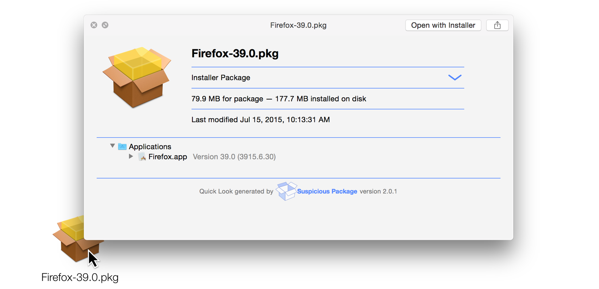

# Using AutoPkgr to Automate Patch Management

_Presented by Elliot Jordan, Senior Consultant, [Linde Group](http://www.lindegroup.com)_<br />_MacIT — July 16, 2015 — Santa Clara, CA_

<!-- MarkdownTOC autolink=true depth=4 bracket=round -->

- [What are we talking about?](#what-are-we-talking-about)
- [What's in it for me?](#whats-in-it-for-me)
- [Introduction to AutoPkgr](#introduction-to-autopkgr)
    - [Installing Git/AutoPkg](#installing-gitautopkg)
    - [Configuring Repos and Recipes](#configuring-repos-and-recipes)
    - [Overrides](#overrides)
- [Integrating with software distribution systems](#integrating-with-software-distribution-systems)
    - [Munki](#munki)
    - [Casper Suite](#casper-suite)
    - [Other Possibilities](#other-possibilities)
- [Recap](#recap)
- [References](#references)

<!-- /MarkdownTOC -->


## What are we talking about?

Before we start, let's define what it is we're talking about: automating patch management with the help of AutoPkgr.

- __automate__: _convert (a process or facility) to largely automatic operation_

    Note the adjective "largely." We are not going to be automating the whole process end-to-end. Automation should be used for its strengths (consistency, reproducibility, and time savings), and humans should be used for their strenghts (critical thinking, analysis, awareness of situational context).

- __patch management__: _the acquisition, delivery, and installation of software to a fleet of computers_

    Many in the Mac admin community don't like the phrase _patch management_, and they're correct. Neither word is quite accurate. We are interacting with all types of software packages, not just "patches." Also, we're not managing them so much as we are testing and deploying them. But when you say patch management, most IT folks know what you mean.

- __AutoPkgr__: _a free Mac app that serves as a front-end interface for the AutoPkg package creation framework_

    AutoPkgr is not a software deployment system in and of itself.* Whatever deployment system you're using now, continue using it. AutoPkgr will simply integrate with and extend your system to provide some automation where there wasn't any.

    You should still be familiar with the underlying tools, including AutoPkg itself. I encourage you to fire up the Terminal and get comfortable with the `autopkg` command. It will make it much easier when troubleshooting is needed in the future.

<sup>\* Setting aside for the moment the idea of .install recipes.</sup>

## What's in it for me?

- No more tedious checking for new software releases. Let your Mac do the work.
- Repackaging manually will become something you do less often.
- Helps to standardize the testing/staging process with reproducible results.
- Consistent deployments that scale well and reduce human error.
- Spend time doing more interesting things.

## Introduction to AutoPkgr

When AutoPkg came out, the Linde Group started using it at many of our clients. It saved us a ton of time. But we found that each place we set it up, we did it just a little differently. We also didn't have an easy way to schedule recurring checks without manually creating LaunchDaemons or resorting to a more advanced system like Jenkins.

Eventually, the awesome [MacBrained](http://macbrained.org/) community challenged Mac admins in the Bay Area to come up with a useful tool to share with the world. AutoPkgr, a friendly face for AutoPkg, was our entry.

Since then, we've been working with Eldon Ahrold and others to keep improving AutoPkgr continuously. It's free and [available on GitHub](https://github.com/lindegroup/autopkgr/releases/latest). Download it and drag it to your Applications folder to get started.

### Installing Git/AutoPkg


We've made the installation of AutoPkg and Git (which AutoPkg requires) really simple.

1. Click the __Install AutoPkg__ button. Enter password when prompted.
2. Click the __Install Git__ button. Enter password when prompted.

### Configuring Repos and Recipes


AutoPkgr (the GUI) tells AutoPkg (the command line tool) to produce packages using recipes, which contain all the necessary instructions.

Recipe authors (members of the Mac admin community, including yourselves) maintain repositories on GitHub that contain their recipes.

You must add a repo before you can run the recipes within.

1. Check the box for the topmost repo in the list. This is the "default" or "main" repo, maintained by the authors of the AutoPkg project. You'll see recipes appear in the list below.
2. As an example, check the recipe for __Firefox.pkg__.
3. Click the __Run Recipes Now__ button. When the process finishes, you can navigate to `~/Library/AutoPkg/Cache/com.github.jss-recipes.jss.Firefox_EN` and see the latest Firefox installer in .pkg format.



If you want to package an app that isn't included in the default repo, you'll need to locate its recipe and corresponding repo. We've made that easy too.

1. In the __Search for a recipe on GitHub__ field, enter __coconutBattery__ as an example.
2. Select the __coconutBattery.pkg__ recipe from homebysix-recipes repo from the list of results. Click __Add Repo__, then __Close__ to return to the recipe list.
3. You should now see coconutBattery.pkg listed among the recipe options. Click the checkbox to add it to your recipe list.
4. Click __Run Recipes Now__, and a coconutBattery.pkg installer will be produced in your AutoPkg cache folder.


Congratulations, you're now a certified AutoPkgr user! But in order to talk about AutoPkgr integration with software distribution systems, we need to take a few minutes to understand AutoPkg recipes and overrides in more detail.

### Overrides

As mentioned before, AutoPkg recipes are simply a list of instructions that AutoPkg follows in order to produce a usable software package. Here's an example: the [__Firefox.download__ recipe](https://github.com/autopkg/recipes/blob/master/Mozilla/Firefox.download.recipe) which simply downloads the latest version of Firefox.

Notice the `RELEASE` input key:

```
    <key>RELEASE</key>
    <string>latest</string>
```

We'll come back to that.

Now let's look at the [__Firefox.pkg__ recipe](https://github.com/autopkg/recipes/blob/master/Mozilla/Firefox.pkg.recipe). Notice that it uses Firefox.download as a "parent."

```
    <key>ParentRecipe</key>
    <string>com.github.autopkg.download.firefox-rc-en_US</string>
```

That means it tells AutoPkg to do everything in Firefox.download (download the .dmg), then immediately do everything in Firefox.pkg (create the .pkg). Still with me?

Now, let's say we wanted to create a .pkg installer for Firefox, but instead of the latest release, we wanted to use Firefox version 3.6. We'd need an "override" for that, and the override would combine the two ideas above.

Here's the entire contents of the override, which lives in `~/Library/AutoPkg/RecipeOverrides`. Don't blink, it's short:

```
<?xml version="1.0" encoding="UTF-8"?>
<!DOCTYPE plist PUBLIC "-//Apple//DTD PLIST 1.0//EN" "http://www.apple.com/DTDs/PropertyList-1.0.dtd">
<plist version="1.0">
<dict>
    <key>Identifier</key>
    <string>local.pkg.Firefox-3.6</string>
    <key>Input</key>
    <dict>
        <key>RELEASE</key>
        <string>latest-3.6</string>
    </dict>
    <key>ParentRecipe</key>
    <string>com.github.autopkg.pkg.Firefox_EN</string>
</dict>
</plist>
```

So it's using Firefox.pkg as its parent, but it's also setting the `RELEASE` key to `latest-3.6`. The result of this is that when we run `autopkg run Firefox-3.6.pkg` (or add Firefox-3.6.pkg to our recipe list in AutoPkgr), we get an installer for that particular version of Firefox:


Using that same method, we can override just about any aspect of an AutoPkg recipe to suit our particular environment. This will become important when we start talking about...

## Integrating with software distribution systems

Now to the juicy bit. How can AutoPkgr take the software packages we want and automatically (and safely) put them into our software distribution system?

First, let's talk about the typical patch management lifecycle.


1. __New release.__
    Software is released by the developer or manufacturer.

2. __Development.__
    You test the software on your own Mac and a few others in a sterile environment to make sure the software installs, launches, and behaves more or less as expected.

3. __Staging.__
    The software is deployed to a small fraction of your organization — ideally to a few people who use the software regularly and can accurately detect and report problems.

4. __Feedback.__
    Based on the problem reports (or lack thereof) from the staging group, the IT team makes a decision on whether to deploy to the rest of the organization or not.

5. __Deployment.__
    The software is deployed to everyone else who needs it.

Automating steps 1, 2, and 3 is our goal. I'm going to show you how you can do that with two popular tools: [Munki](https://www.munki.org/) and [Casper](http://www.jamfsoftware.com/products/).

### Munki

With .munki recipes and a little configuration, you can have new software automatically arrive in your Munki repo. Additionally, recipe overrides allow us to adjust input keys to our organizations, including which catalog(s) the package is associated with upon import.

Here's how to have new software automatically arrive in the __development__ and __staging__ catalogs. (Your organization's catalog names may vary, of course. This guide assumes that you have already configured the Munki catalogs and manifests as desired.)

1. In AutoPkgr's recipe list, find the Firefox.munki recipe. Right-click on it, and choose Create Override.
    

2. (Optional) Right-click again and set the recipe editor to your preferred text editor. I suggest [TextWrangler](http://www.barebones.com/products/textwrangler/), if you're just getting started.
3. Name the override __Firefox-staging.munki__. Click __OK__.
4. Find the override you just created in the list, and check its box. Then right-click and click __Open Recipe Override__.
5. Find the `catalogs` key, and add the development and staging catalogs as follows:

    ```
        <key>catalogs</key>
        <array>
            <string>development</string>
            <string>staging</string>
        </array>
    ```

    Override other information as needed. (`MUNKI_REPO_SUBDIR` and `description` are likely candidates.)

6. Click the __Run Recipes Now__ button, and you'll find that the Firefox package is automatically imported to both your __development__ and __testing__ catalogs.

Let's step back and take a look at what we just did.


When a new version of Firefox is released, all the Macs associated with those catalogs will be updated automatically, which allows you to focus on the feedback and deployment steps.

### Casper Suite

We can produce similar automation with the Casper Suite. The use of .jss recipes designed for the [JSSImporter](https://github.com/sheagcraig/JSSImporter) processor allows highly configurable importing of new packages into your Casper JSS, along with the necessary smart groups and policies to make the packages available to your development and staging group.

There are a few more moving parts here than with Munki, but getting the basics running is actually pretty easy:

1. Create an API user on your JSS (details [here](https://github.com/lindegroup/autopkgr/#integration-with-casper)).
2. Go to the __Folders & Integration__ tab.
3. Click on __Install JSSImporter__, and enter your password when prompted. The [official jss-recipes repo](https://github.com/autopkg/jss-recipes) will automatically be added.
4. Click on __Configure JSSImporter__.
    
5. Enter your JSS's URL, your API username, and your API password (which you created in step 1). Click __Verify__, then __Connect__. Enter passwords for distribution points, if prompted to do so.
6. Click __Close__ and go back to the __Repos & Recipes__ tab.
7. Add the __Firefox.jss__ recipe.

As with Munki, you can create .jss overrides to customize things, but this accomplishes the automation we're seeking with minimal fuss.


When a new version of Firefox is released, a policy that updates Firefox will be automatically available in Self Service for Macs in the Testing group on the JSS.

__Bonus__: Here's a tip not related to AutoPkgr, but it's right up your alley if you're integrating Casper with AutoPkg.

With another tool called jss_helper, we can also automate the eventual reconfiguration of the policy that deploys the software to your production environment.

With jss_helper installed and configured, running this command updates the package associated with the Firefox policy from 38.0.5 to 39.0. This would take more than a couple clicks to do manually in the JSS.

```
jss_helper promote "Deploy Latest Firefox" "Firefox-39.0.pkg"
```

Here's what the policies look like before the `jss_helper promote` command:


And after:


So although human intervention will (and should) still be necessary to get from staging to deployment, jss_helper gives you superhuman powers and ensures consistent behavior each time.


### Other Possibilities

Now you know that with AutoPkgr, it's easy to automate your software distribution workflow in Munki or Casper. If you're not a Munki or Casper user, you may be feeling left out. Fear not!

- __Absolute Manage__
    Starting with AutoPkgr 1.3, we've integrated the [AbsoluteManageExport](https://github.com/tburgin/AbsoluteManageExport) into AutoPkgr for easy configuration with .absolute recipes.

- __MacPatch__
    Also in AutoPkgr 1.3, we've integrated the [MacPatchImporter](https://github.com/SMSG-MAC-DEV/MacPatch-AutoPKG) into AutoPkgr for easy configuration with .absolute recipes.

- __SCCM__
    Microsoft System Center Configuration Manager users can join in with .sccm recipes and the [CMAppUtil](https://technet.microsoft.com/en-us/jj687950.aspx) tool.

- __DeployStudio__
    Although this is closer to imaging configuration management than patch management, you can use .ds recipes to automatically connect AutoPkg recipes with your DeployStudio repository.

- __Apple Remote Desktop and other deployment tools__
    With .pkg recipes alone, you can generate standard Apple installers that can be used with other deployment tools, even Apple Remote Desktop. (But [admins don't let admins use ARD](http://www.cafepress.com/macadmins.1408086154).)

- __.install recipes__
    Running .install recipes in AutoPkgr on your development Mac will ensure that it's always got the latest software for immediate testing. (.install recipes not recommended for staging or deployment.)

## Recap

Here's what we've accomplished today:


- AutoPkgr tells AutoPkg to run regularly and download new updates.
- Repackaging happens automatically, and only if necessary.
- The software is set up to be tested and staged automatically.
- Allows IT staff to focus where it matters: careful deployment to production.
- Use your new spare time to learn the guitar. (Or write AutoPkg recipes.)

Thank you!


&nbsp;

## References

- [AutoPkgr](http://www.lindegroup.com/autopkgr) — The free open source GUI Mac app that serves as a front-end for AutoPkg.
- [AutoPkg](https://autopkg.github.io/autopkg/) — The free open source command line tool that automates packaging Mac software.
- [Munki](https://www.munki.org/) — A free open source tool for managing OS X, including the ability to easily distribute software to your fleet.
- [MunkiAdmin](https://hjuutilainen.github.io/munkiadmin/) A free Mac app for managing Munki repositories.
- [Munki-in-a-Box](https://github.com/tbridge/munki-in-a-box) — Shell script for easily setting up Munki for the first time. Includes AutoPkg and AutoPkgr as well.
- [Casper](http://www.jamfsoftware.com/products/) — Popular commercial software for Mac and mobile endpoint management.
- [JSSImporter](https://github.com/sheagcraig/JSSImporter) — AutoPkg processor that uploads packages to your JSS and creates custom policies for them.
- [jss_helper](https://github.com/sheagcraig/jss_helper) — A command line tool for performing certain operations on your JSS.
- [Auto Update Magic](https://github.com/homebysix/auto-update-magic) — Elliot Jordan, JAMF Nation User Conference 2014 — Instructions and example worfklows for integrating AutoPkgr with the Casper Suite.
- [Integrating AutoPkg and the Casper Suite with JSSImporter (12 MB PDF)](http://macadmins.psu.edu/wp-content/uploads/sites/1567/2015/07/psumac2015-57-IntegratingAutoPkgAndTheCasperSuiteWithJSSImporter.pdf) — Shea Craig, PSU MacAdmins 2015 — Mostly just lots of animated GIFs.
- [Absolute Manage](https://www.absolute.com/en/products/absolute-manage) — Cross-platform commercial software for endpoint management.
- [AbsoluteManageExport](https://github.com/tburgin/AbsoluteManageExport) — Processor for integrating AutoPkg with Absolute Manage.
- [MacPatch](https://macpatch.github.io/) — Another free open source tool for managing Macs, similar to Munki in some ways.
- [MacPatchImporter](https://github.com/SMSG-MAC-DEV/MacPatch-AutoPKG) — Processor for importing AutoPkg with MacPatch.
- [DeployStudio](http://deploystudio.com/) — Free tool for quickly imaging and configuring Macs.
- [xkcd: Automation](https://xkcd.com/1319/) — We love making AutoPkgr, but the ongoing development definitely offsets the time saved. :-)
